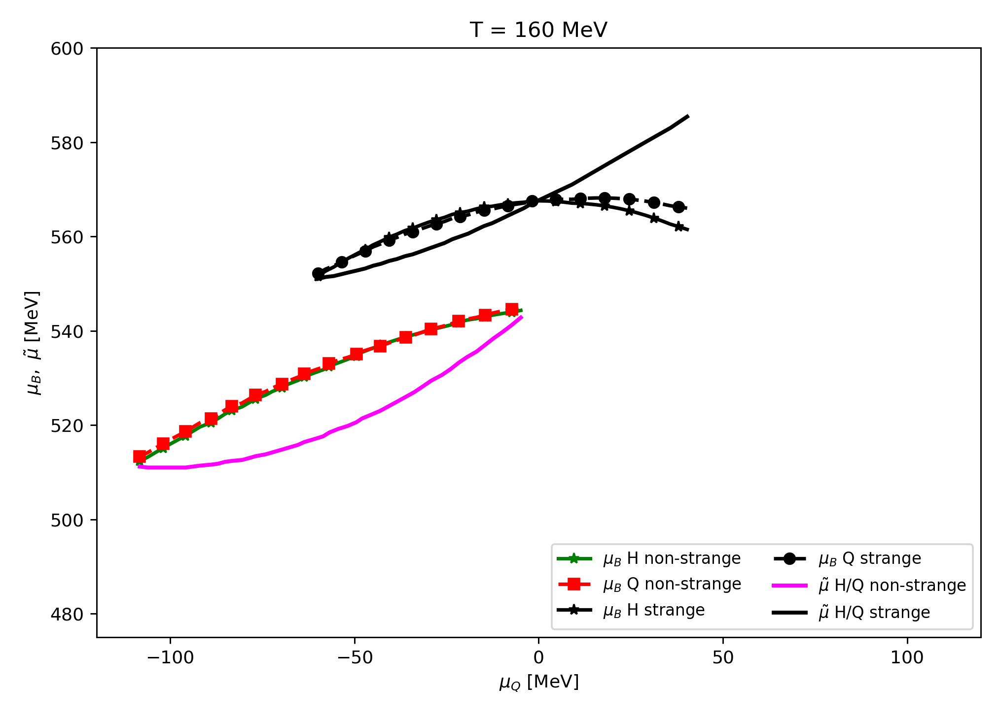
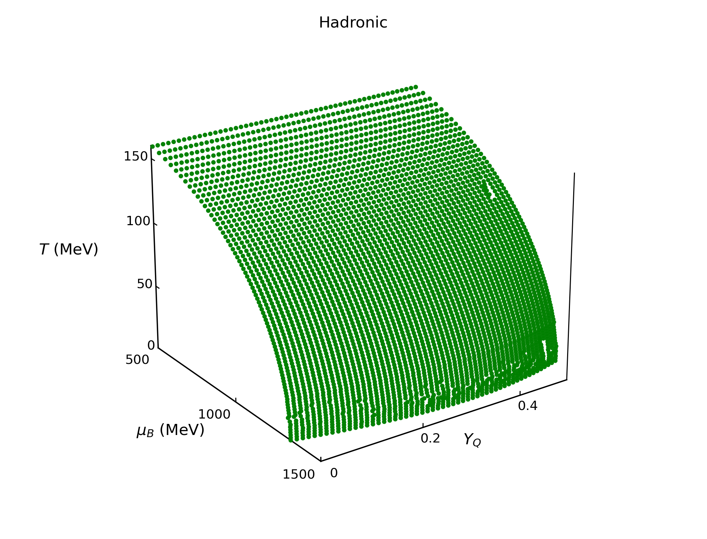
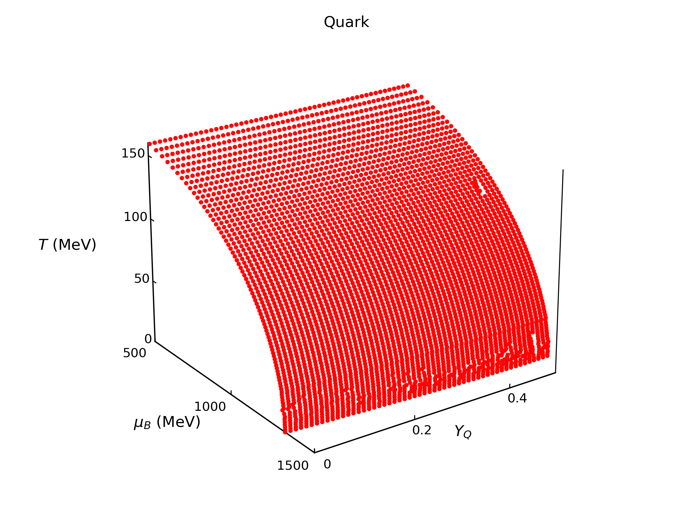
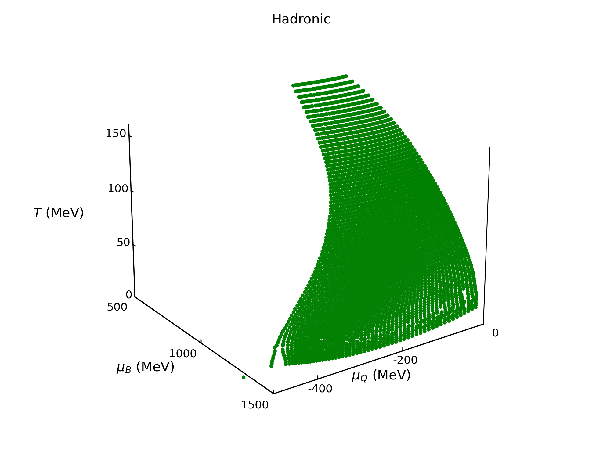
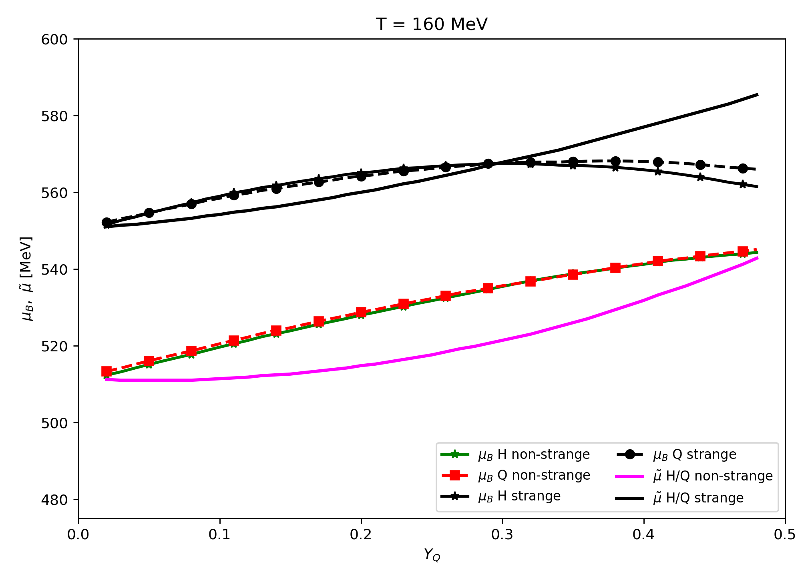
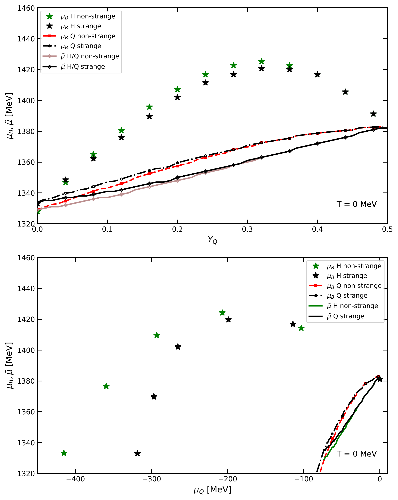

# QCD Phase Transitions: Breakthrough Computational Physics Research

[](https://fortran-lang.org/)
[](https://www.python.org/)
[](https://doi.org/10.1103/PhysRevD.102.076016)

## 🏆 Breakthrough Research Achievement

**First comprehensive study of charge/isospin fraction effects on QCD deconfinement transitions**

This repository showcases groundbreaking computational physics research that bridges heavy-ion collision and astrophysics communities. The work presents novel 3D phase diagrams and advanced numerical methods that reveal previously unknown relationships in quantum chromodynamics, with direct applications to understanding neutron star mergers and particle collision experiments.

### 🎯 Research Impact & Innovation
- **🥇 First-of-its-Kind Study**: Comprehensive analysis of charge vs. isospin fraction effects on phase transitions
- **📊 Advanced Computational Methods**: 3D phase diagrams using Chiral Mean Field (CMF) model
- **🌉 Bridging Communities**: Connecting heavy-ion collision and astrophysical research approaches
- **📈 Quantified Discoveries**: Chemical potential variations up to 330 MeV across phase boundaries
- **📚 Published Excellence**: Physical Review D ([DOI: 10.1103/PhysRevD.102.076016](https://doi.org/10.1103/PhysRevD.102.076016))

## 🔬 Computational Physics Results

### Novel 3D Phase Diagram Analysis

**Research Achievement**: Deconfinement coexistence line analysis at T=160 MeV showing baryon chemical potential (μB) and free energy (μ̃) relationships across charge fractions (YQ). **Impact**: Reveals how charge fraction changes from YQ=0→0.5 can shift baryon chemical potential by up to 130 MeV.

### Hadronic Phase Computational Modeling
 
**Research Achievement**: CMF model solutions for hadronic matter thermodynamics showing chemical potential relationships. **Discovery**: For non-strange matter, charge/isospin chemical potentials μQ and μI range from -420 to 0 MeV along the deconfinement coexistence line.

### Quark Matter Phase Calculations

**Research Achievement**: Quark matter phase calculations demonstrating deconfinement transitions. **Key Finding**: On the quark-phase side, μQ and μI lie between -75 and 0 MeV, showing matter is less sensitive to charge fraction changes due to fractional quark quantum numbers.

### Multi-Parameter Chemical Potential Analysis

**Research Achievement**: Complex relationship mapping between charge chemical potential (μQ) and baryon chemical potential (μB). **Significance**: Demonstrates how different charge fractions (YQ ∼ 0.4-0.5 vs YQ ∼ 0.1-0.15) can change phase transition positions by hundreds of MeV.

### Comprehensive Phase Space Mapping

**Research Achievement**: Temperature-dependent phase analysis revealing strangeness effects. **Discovery**: At high temperatures with strangeness, μQ and μI become less negative and even positive, reaching ~50 MeV.

### Research-Quality Publication Results

**Research Achievement**: Comprehensive comparison of T=0 and T=160 MeV results published in Physical Review D. **Impact**: Provides critical tool for comparing heavy-ion collision and astrophysical scenarios.

## 🚀 Key Research Discoveries

### Breakthrough Findings
- **🔍 Charge Fraction Impact**: YQ changes from 0→0.5 can shift:
  - Baryon chemical potential by up to **130 MeV**
  - Free energy by up to **50 MeV**  
  - Charge/isospin chemical potential by up to **330 MeV**

- **🌡️ Temperature Effects**: At T=160 MeV with strangeness:
  - μQ and μI range shifts from -320 to 0 MeV (vs -420 to 0 MeV without strangeness)
  - Chemical potentials can become **positive**, reaching ~50 MeV

- **⚛️ Phase Sensitivity**: Quark matter shows **reduced sensitivity** to charge fraction changes compared to hadronic matter due to fractional quantum numbers

### Community Impact
- **🔬 Heavy-Ion Collision Community**: Historically modeled systems with fixed isospin fraction
- **🌌 Astrophysical Community**: Traditionally used charge fraction modeling  
- **🤝 Bridge**: This work provides the **first comprehensive tool** for comparing results between communities

## 🛠️ Advanced Computational Methods

### High-Performance Computing
```fortran
! Chiral Mean Field (CMF) model implementation
! Self-consistent field calculations for phase equilibrium
! Multi-parameter thermodynamic optimization
! 3D phase diagram generation with precise convergence